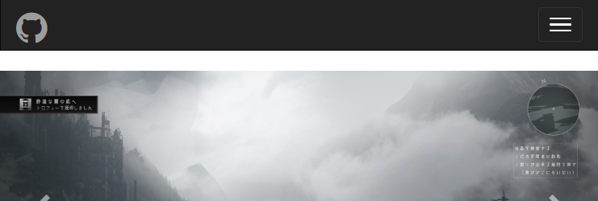
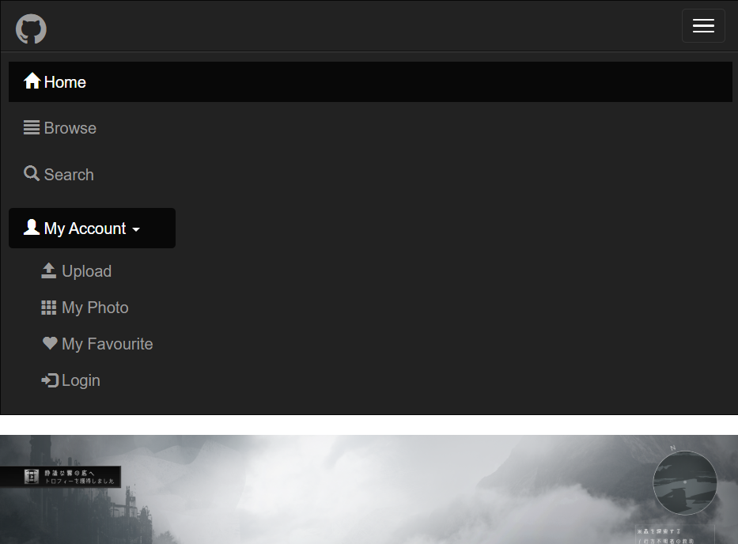
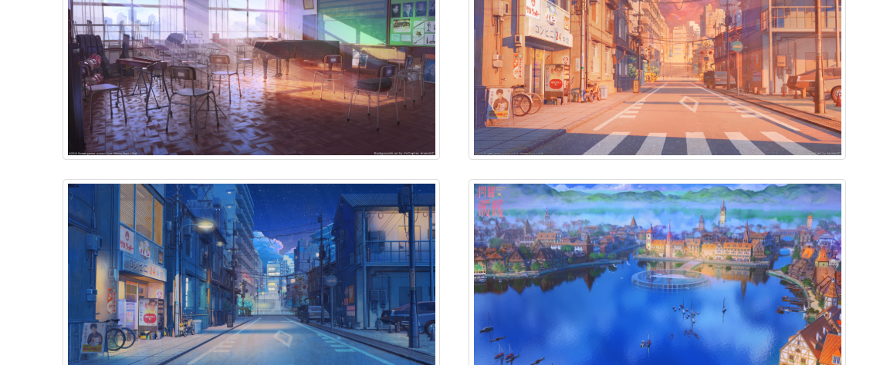
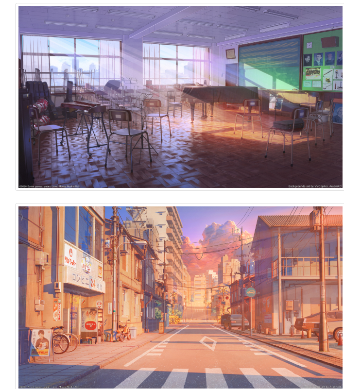

# Lab4设计文档

### 作业提交

姓名：赵书誉

学号：18307110072

作业提交网址：https://github.com/Dying-fish/SOFT130002_lab/tree/master/lab4


## 主页截图

#### Chrome浏览器


#### Firefox浏览器


## 设计思路

页面由导航栏，轮播，缩略图和页脚构成，css代码用于设置导航栏logo位置，页脚背景色，备案号居中与元素的内外边距。

### 导航栏

先创建一个带有黑色背景白色文本的反色的导航栏， 用**.navbar-right** 使My Account居于导航栏右侧

```
<nav class="navbar navbar-inverse" role="navigation">
```

在浏览器窗口不够大时变为下拉菜单，用三个带有 class .icon-bar 的 <span> 创建汉堡按钮 。折叠起来的导航栏实际上是一个带有 class **.navbar-toggle** 及两个 data- 元素的按钮。

#### 效果图






### 轮播

使用bootstrap中的轮播（Carousel）插件实现。提交的作业分为三个部分：

1. 轮播指标 carousel-indicators

   即图片下方的白圈，点击可以翻至相应图片，并当翻至相应图片时变为实心

2. 轮播项目 carousel-inner

   即轮播的图片,此处方便起见我选择了画师あすてろid的作品，图片格式统一

3. 轮播导航 carousel-control

   即图片两侧的左右箭头，点击后可以翻至前/后一张图片

   

### 缩略图

使用bootstrap中的缩略图实现，在图像外层套一个带有 class **.thumbnail** 的<a>或<div>即可。

由于bootstrap使用grid网格布局，可以设置不同屏幕大小时每行图片的个数（超小设备时每行1张）

```
  <div class="col-xs-12 col-sm-6 col-md-4">
```

#### 效果图

##### 小型设备显示



##### 手机（超小设备）显示




### 页脚

此处只使用了网格布局使使用条款等，QQ的logo等与个人微信号分为四部分