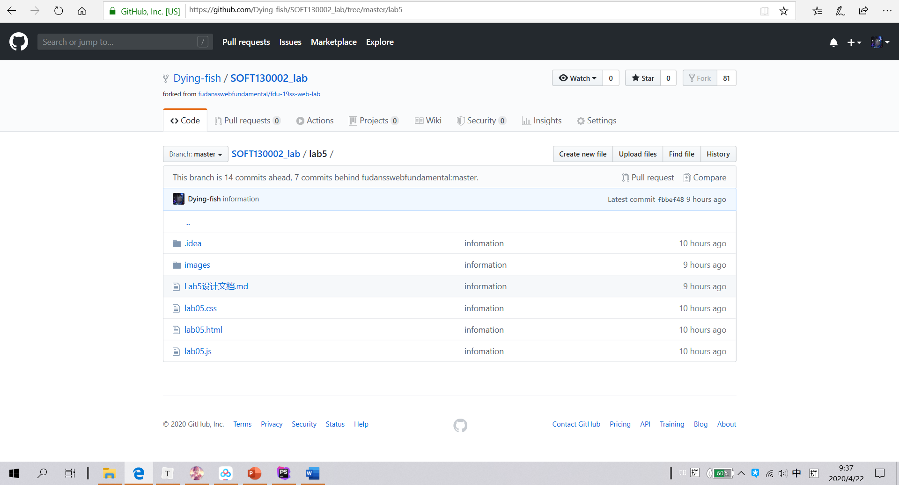

# Lab5设计文档 #

姓名：赵书誉

学号：18307110072赵书誉

作业提交网址： https://github.com/Dying-fish/SOFT130002_lab


## 效果截图





## 作业需求

#### 获取参数

1. 获取URL中名为name的参数。在URL输入框输入URL，点击同行submit按钮后，其中的参数名为name的参数值需要出现在Argument value输入框内。

2. 如果没有名为name的参数，那么可以在Argument value输入框出现任何值。

3. 请仅在函数showWindowHref内写代码。

   

###### 知识点

**字符串：**字符串函数，*正则表达式（可选）*


#### 自动计数

1. 每隔五秒运行一次函数直到某一整分钟停止，比如从20:55:45运行到20:56:00停止；或者运行10次，先到的为准。从1开始每过五秒，输入框内数值翻倍。初始值为1。

2. 可以在函数 timeTest内部 和 timeTest外部 写代码使得该功能实现。

   

###### 知识点

**JavaScript 计时事件**

**JavaScript 获取日期方法**


#### 统计字符

1.  判断输入框most里出现最多的字符，并统计出来。统计出是信息在most_result输入框内以"The most character is:" + index + " times:" + max的形式显示。

2. 如果多个出现数量一样则选择一个即可。

3. 请仅在arrSameStr函数内写代码。

   

###### 知识点

**字符串：**字符串函数

**对象：**增改属性

**循环：**for-in循环


## 解决方法

#### 获取参数

由于URL的格式为（若干字符串）?（参数名1）=（参数1值）&（参数2）=（参数2值）... 

因此可以用字符串函数将URL的参数名分割成几段，然后寻找参数名为name的一段

```javascript
function showWindowHref(){
    let name,value;	
    let str=url.value;
    url_result.value = "";	//初始化值
    let index = str.indexOf("?");	//寻找参数名开始的位置		
    str = str.substr(index+1);	//找出子串
    let arr=str.split("&");	//分割参数名
    for(let i=0;i<arr.length;i++){	//遍历数组
        index = arr[i].indexOf("=");	
        if(index>0) {	//记录参数名与参数值
            name = arr[i].substring(0,index);
            value = arr[i].substr(index+1);
        }
        if (name=="name"){	//判断是否为所求参数名
            url_result.value = value;
            break;
        }
    }
    if (!url_result.value){
        url_result.value = "null";	//若未找到，返回null
    }
}
```


#### 自动计数

```javascript
function timeTest(){	
    if(mul.value){	//判断输入框内容是非为空
        mul.value *= 2;	//翻倍
    }
    else{
        mul.value = 1;	//初始化值
    }
    let time = new Date().getSeconds();	//获取当前时间的秒数
    if(mul.value<1024&&(time-56)<0){	//判断是否已运行十次或到某一整分钟
        setTimeout(timeTest,5000);	//5s后再次运行该函数
    }
};
setTimeout(timeTest,5000);	//5s后开始运行timeTest函数
```


#### 统计字符

先定义一个空对象，然后遍历字符串，将每个不同的字符作为属性赋给对象，字符出现的次数为值，最后遍历对象属性，找出频率最高的字符。

```javascript
function arrSameStr(){
    let Obj = [];	//定义空对象
    let content = most.value;
    let max=0;	//初始化
    let index ="";	
    for(let i=0;i<content.length;i++){	//遍历输入的字符串的字符
        if(Obj[content.charAt(i)]){	//判断该属性是否存在
            Obj[content.charAt(i)]++;	//存在则+1
        }
        else{	//不存在则增添新属性并初始化
            Obj[content.charAt(i)] = 1;
        }
    }
    for(let char in Obj){	//遍历对象属性
        if(Obj[char]>max){	//判断是否值更大
            max = Obj[char];
            index = char;
        }
    }
    result.value = "The most character is:"+ index + " times:" + max;	//输出
}
```