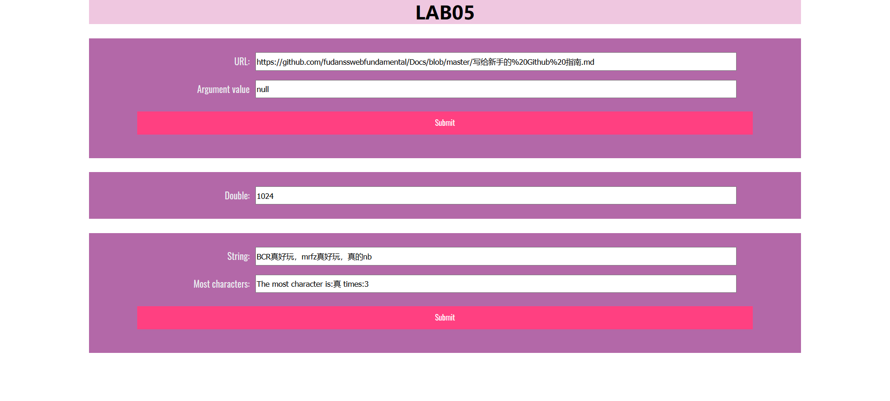

# Lab5设计文档 #

姓名：赵书誉

学号：18307110072赵书誉

作业提交网址： https://github.com/Dying-fish/SOFT130002_lab

## 效果截图

## 作业需求

#### 获取参数

1. 获取URL中名为name的参数。在URL输入框输入URL，点击同行submit按钮后，其中的参数名为name的参数值需要出现在Argument value输入框内。

2. 如果没有名为name的参数，那么可以在Argument value输入框出现任何值。

3. 请仅在函数showWindowHref内写代码。

   

###### 知识点

数组

#### 自动计数

1. 每隔五秒运行一次函数直到某一整分钟停止，比如从20:55:45运行到20:56:00停止；或者运行10次，先到的为准。从1开始每过五秒，输入框内数值翻倍。初始值为1。

2. 可以在函数 timeTest内部 和 timeTest外部 写代码使得该功能实现。

   

###### 知识点

#### 统计字符

1.  判断输入框most里出现最多的字符，并统计出来。统计出是信息在most_result输入框内以"The most character is:" + index + " times:" + max的形式显示。

2. 如果多个出现数量一样则选择一个即可。

3. 请仅在arrSameStr函数内写代码。

   

###### 知识点

数组

循环

## 解决方法

