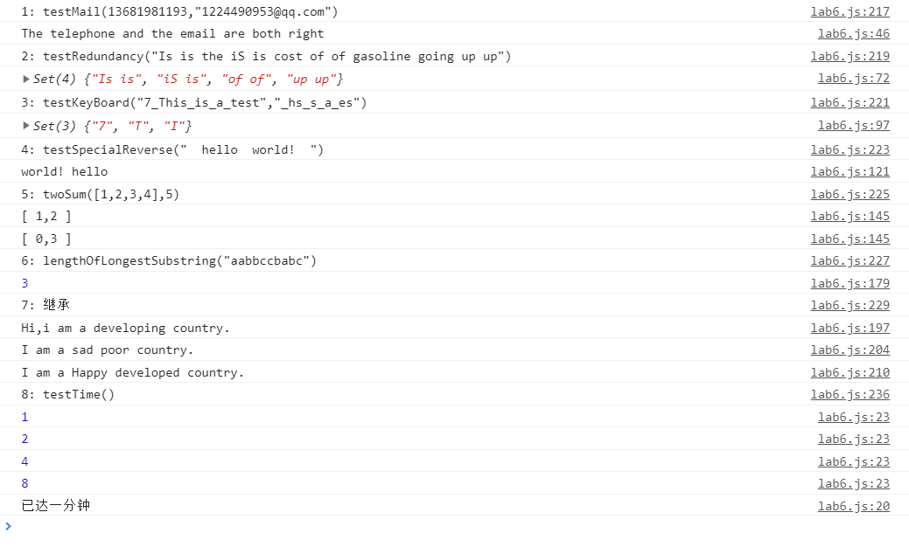
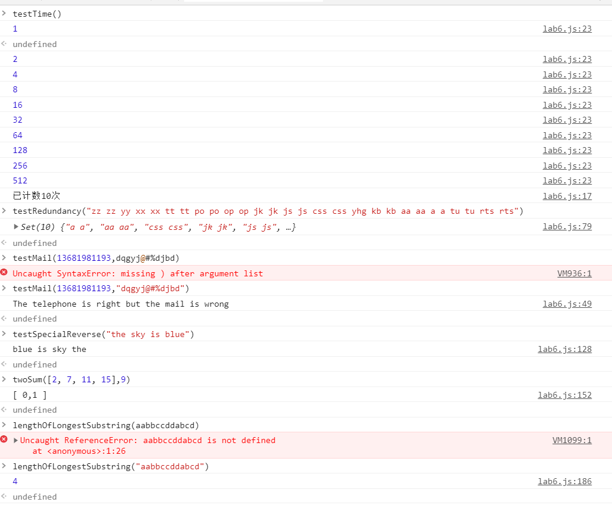

# 设计文档

姓名：赵书誉

学号：18307110072

提交网址：https://github.com/Dying-fish/SOFT130002_lab/tree/master/lab6


### 效果图






## 闭包

#### 第一题

在函数内部再定义一个子函数，子函数参数为变化的数和计次的数，运行时先获取当前时间，根据时间和计次判断做出相应的操作，用setTimeout调用自身。


## 正则表达式

#### 第二题

```javascript
let telstr = /^1[3,4,5,7,8,9]\d{9}$/;
let mailstr = /^[a-zA-Z0-9_-]+@[a-zA-Z0-9_-]+(\.[a-zA-Z0-9_-]+)+$/;

/*
telstr是验证手机用的正则表达式 /^为匹配字符串的开头，$/为匹配字符串的结尾，1[3,4,5,7,8,9]\d{9}表示开头第一个字符是1，第二个字符是[3,4,5,7,8,9]中的一个，\d表示匹配数字，{9}表示匹配前面的子表达式9次
mailstr是验证邮箱的正则表达式，[a-zA-Z0-9_-]表示字母数字下划线和中划线，+表示至少匹配一次，这是邮箱的名称部分，然后邮箱一定含有@，后面跟着[N级域名].[三级域名.]二级域名.顶级域名，因此域名第一部分的表达式是[a-z0-9-]+，多级域名用+(\.[a-zA-Z0-9_-]+)+表示。
*/
```

#### 第三题

```javascript
let patt = /\b([a-z]+) \1\b/ig;
let set = new Set();
let i = 0;
for(let item of str.match(patt).sort()){
    if(i<10){
        set.add(item);
        i++;
    }
    else break;
}
/*
\b匹配一个单词边界，第一部分[a-z]+匹配一个或多个字母，第二部分是对以前捕获的子匹配项的引用，\1 指定第一个子匹配项，单词的第二个匹配项正好由括号表达式匹配。
g标记指定查找到的尽可能多的匹配。
i标记指定不区分大小写。
sort()对结果进行排序后，存入集合
*/
```


## 继承

#### 第八题

```javascript
function DevelopingCountry(){	//构造函数
    Country.call(this);
    this.sayHi = function() {
        console.log("Hi,i am a developing country.");
    }
}
	
function PoorCountry() {	//原型链
}
PoorCountry.prototype = new Country();
PoorCountry.prototype.saySad = function () {
    console.log("I am a sad poor country.");
}

function DevelopedCountry() {	//Object.create，在创建对象时复制了Country并增添了sayHappy函数
    return Object.create(new Country(), {	
        sayHappy: {
            value: function () {
                console.log("I am a Happy developed country.")
            }
        }
    })
}
```


## Map、Set、Array

#### 第四题

由于参数是字符串，可以在单次循环中一个字符一个字符地比较两个字符串的异同。此处是借用集合Set中的元素是不可重复的这一点特性。

```javascript
/*
当wantInput字符串中的某个位置的字符与actualInput中相应位置的字符不同时，向集合中添加该字符
*/
  for(let i=0,j=0;i<wantInput.length;i++){
        if(wantInput.charAt(i).toUpperCase()!=actualInput.charAt(j).toUpperCase()){
            //集合中记录的是损坏键的大写样式，利用集合特性可以保证元素不会重复
            set.add(wantInput.charAt(i).toUpperCase());
        }
/*
字符相同时，移到下一个位置
*/      
        else j++;
    }
```

#### 第五题

参数是字符串，因此直接利用字符串的split函数转化为数组，再用Array中的reverse函数实现反转（这几步可以并在一起），最后排除掉空字符串后输出

```
let array = new Array();
array = (str.trim().split(" "));
array.reverse();
let res= "";
for(let item of array){
    if(item!=""){
        res = res + item + " ";
    }
}
```

#### 第六题

Map是一组键值对的结构，查找速度很快，利用这一点存储数组中每个不同的值和其下标（值为键），然后循环时从map查找是否有当前值所需求的另一个值，存在则输出该数组

```javascript
let map = new Map();
for(let i=0;i<nums.length;i++){
    map.set(nums[i],i);	//添加或修改到map中
    let res = target - nums[i];	//所需求的值
    if(map.has(res)){
        console.log("[ "+map.get(res)+","+i+" ]");
    }
}
```

#### 第七题

原理同上，键值为字符，值为当前最后出现时的下标

```javascript
for(let i=0;i<str.length;i++){	//循环
    let char = str.charAt(i);	//当前字符
    if(map.has(char)&&map.get(char)>=start){	//若字符与现有字符串中的某个字符相同
        temp = str.substring(map.get(char)+1,i+1);	//修改记录字符串
        start = map.get(char)+1;	//更改起点
    }
    else{
        temp = temp+char;	//将该字符添加到记录字符串后面
        max = (temp.length>max)?temp.length:max;	//取最大值
    }
    map.set(char,i);
}
```


### 总结

Map、Set、Array之间的区别和使用。 共同点是都可以对对象进行增删，判断元素有无


##### Set:

- 特点：存储的元素不可重复

- 无索引

  

##### Array：

- 特点：存储的元素可重复，有序

- 有索引

  

##### Map：

- 特点：键值对映射的集合，查找速度快


