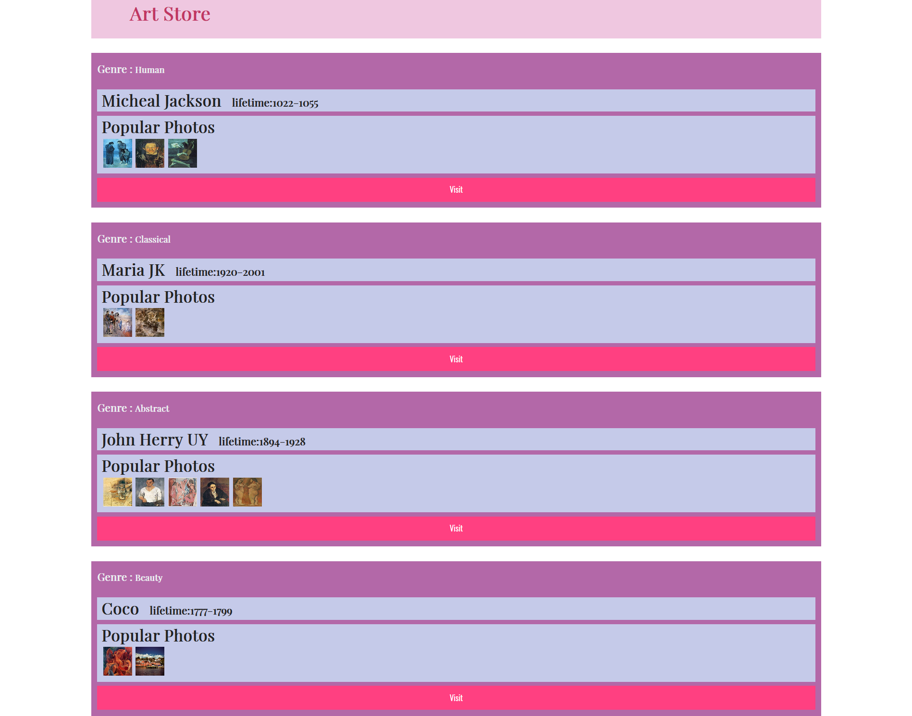

# 设计文档

姓名：赵书誉

学号：18307110072

提交地址：https://github.com/Dying-fish/SOFT130002_lab/tree/master/lab7


## 效果图




## 设计思路

由于板块样式一致，思路是循环制作一个class为item的div添加到header里。然后每次循环中都将一个个区块分别制作出来，最后合在一起。每个区块都单独用一个函数制作。


#### 风格部分

```
function createGenre(i) {
	//创建一个h4元素
    let genre = document.createElement("h4");
    //添加内容
    genre.append("Genre : ");
    //创建一个h5元素并添加内容
    let style = document.createElement("h5");
    style.append(works[i]["tips"]);
    //将h5元素的display属性改为inline，这样便可与h4元素并排显示
    style.style.display = "inline";
    genre.append(style);
    return genre;
}
```

此处直接将h5元素插入到h4元素内，虽然格式并不规范，但Chrome，edge，Firefox浏览器下都可正常显示。


#### 画家名称及寿命

这部分一开始被干扰项item p卡住了，然后助教说可以设置display以及marginLeft，就没问题了。

```
function createAuthor(i) {
    let author = document.createElement("div");
    //添加class
    author.classList.add("inner-box");
    let title = document.createElement("h3");
    title.append(works[i]["author"]);
    title.style.display = "inline";
    let life = document.createElement("h4");
    life.append("lifetime:"+works[i]["lifetime"]);
    //设置h4元素的属性
    life.style.display = "inline";
    life.style.marginLeft = "1em";
    //添加到div中
    author.append(title);
    author.append(life);
    return author;
}
```


#### 著作

```
function createPhoto(i) {
    let photo = document.createElement("div");
    photo.classList.add("inner-box");
    let title = document.createElement("h3");
    title.append("Popular Photos");
    photo.append(title);
    //循环添加图片
    for (let j=0;j<works[i]["photos"].length;j++){
        let image = document.createElement("img");
        //设置图片的src并添加class
        image.src = works[i]["photos"][j];
        image.classList.add("photo");
        photo.append(image);
    }
    return photo;
}
```


#### 按钮

```
function createButton() {
    let button = document.createElement("button");
    button.append("Visit");
    return button;
}
//真没什么好说的
```


### 困难与解决方案

被 ”除了lab07.js以外的其他文件代码不能有任何修改，否则直接0分。“这句话误导了，以为不能修改添加css属性中的display，margin属性。整体做下来感觉挺顺畅的，希望不要因为一些细枝末节的地方被扣分。