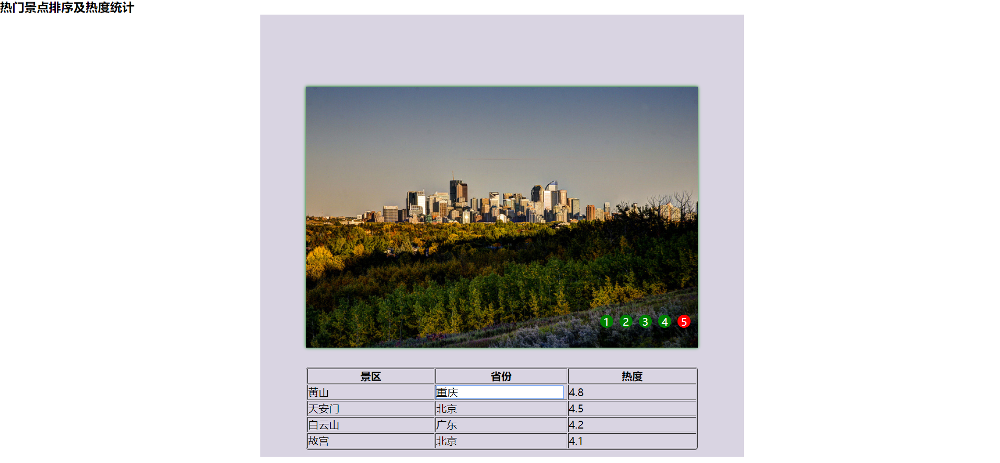

# 设计文档

姓名：赵书誉

学号：18307110072

提交地址：https://github.com/Dying-fish/SOFT130002_lab/tree/master/lab8


### 效果图





### 设计思路

主要思路是定义一个切换图片的函数与一个记录图片下表的变量。

#### 全局变量

```
var buttonList = document.getElementsByClassName("buttons").item(0).children; // 按钮列表
var arrowList = document.getElementsByClassName("arrow");	//箭头列表
var imageList = document.querySelectorAll("img");	//图片列表
var imageIndex = 1;	//图片下标
var loop;	//循环
function switchImage(index){	//实现跳转的函数
    imageIndex = index;		//更改图片下标
    for (let i =1;i<imageList.length-1;i++){	//隐藏非目标图片
        if (i==index) imageList.item(i).style.display = "block";	//只让目标图片显示
        else imageList.item(i).style.display = "none";
    }
    document.getElementsByClassName("on").item(0).classList.remove("on");	//更改按钮样式
    buttonList.item(index-1).classList.add("on");
    if (imageIndex<5) {		//实现轮播
        loop = setTimeout(switchImage, 2000, imageIndex + 1);
    }
    else {		
        loop = setTimeout(switchImage,2000,1);
    }
};
```


#### 任务一

```
arrowList.item(0).onclick = function () {	//左箭头prev
    if (imageIndex==1) imageIndex = 5;	//判断并记录前一张图片的下标
    else imageIndex--;	
    window.clearTimeout(loop);	//停止原先的轮播
    switchImage(imageIndex);	//跳转到相应图片
}
arrowList.item(1).onclick = function () {	//右箭头next
    if (imageIndex==5) imageIndex = 1;
    else imageIndex++;
    window.clearTimeout(loop);
    switchImage(imageIndex);
}
```


#### 任务二

```
switchImage(imageIndex);	//初始化，开始轮播
for (let i =1;i<imageList.length-1;i++){	
    imageList.item(i).onmouseover = function (){
    	clearTimeout(loop)
    };	//鼠标悬浮在图片上时停止轮播
    imageList.item(i).onmouseout = function (){
    	switchImage(imageIndex)
    }; //鼠标离开时继续轮播
}
```


#### 任务三

```
for (let i=0;i<buttonList.length;i++){
    buttonList.item(i).onclick = function () {
        window.clearTimeout(loop);	//点击按钮时停止原先轮播
        switchImage(i+1);	//切换到相应的图片并开始轮播
    }
}
```


#### 任务四

此处省略了一些用于修改样式的代码，只展示令表格可编辑

```
$(document).ready(function(){
    $("td").click(function(event){	//点击非表头表格时执行函数
        if($(this).children("input").length > 0)	//若已存在文本框则返回
            return false;
        let temp = $(this);	
        let preText = temp.html();	   //得到当前文本内容
        let input = $("<input type='text' value='"+preText+"'/>");	//创建一个文本框
        temp.html(""); 	//清空表格
        input	//设置文本框样式
            .width("195px")
            .height("auto")
            .css({border:"0px",fontSize:"17px"})
            .appendTo(temp);	//插入到表格里
        $("input").selectionEnd = 0;	//使光标自动定位于单元格的首个字符或者汉字前
        $("input").focus();	//获得聚焦
        input.keyup(function(event){	
                if(13 == event.which)	//按下回车后修改表格
                {
                    let text = input.val();		
                    temp.html(text);	//将表格内文字修改为文本框中输入的内容
                }
            });
        $("input").blur(function () {	//失去聚焦后执行函数，功能同上
            let text = input.val();
            temp.html(text);
        })
        //已进入编辑状态后，不再处理click事件
        input.click(function(){
            return false;
        });
    });
});
```


#### 总结

~~jquery真好用~~

效果图可能跟视频中显示的区别比较大，动画效果没有做（菜鸟教程中是在css中实现离开与进入动画的，jquery也可以使用fade或animate功能，担心和要求不符就没有使用），但功能都实现了，请原谅。