This directory is used to save screenshots

# 个人信息

姓名：赵书誉

学号：18307110072

提交地址：https://github.com/Dying-fish/SOFT130002_lab/tree/master/lab9


## Exercise0

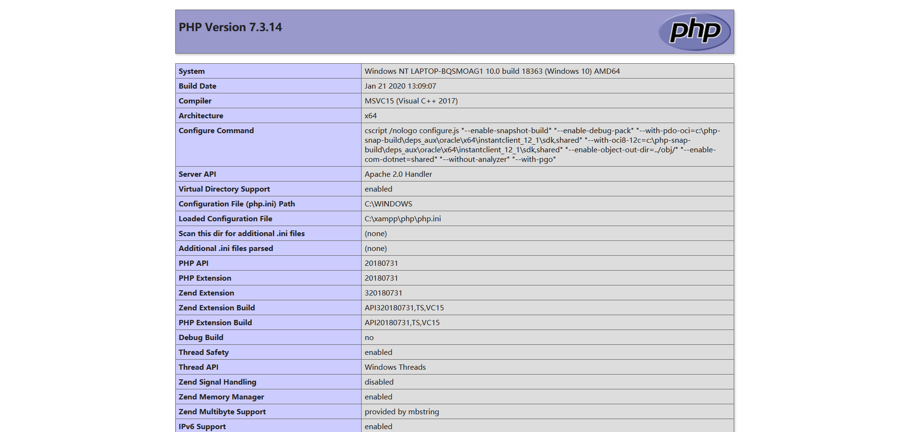

## Exercise1

#### Exercise 1-1

###### 网页截图

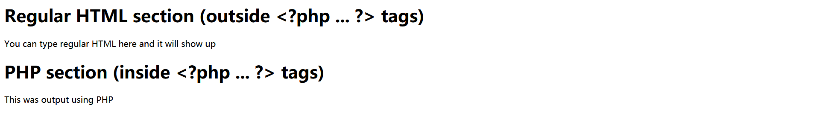


#### Exercise 1-2 / 1-3

可以从图中看出，PHP代码部分由服务器处理，并不会发送给浏览器，故浏览器上只能看到经过处理后的文字。

###### 网页截图

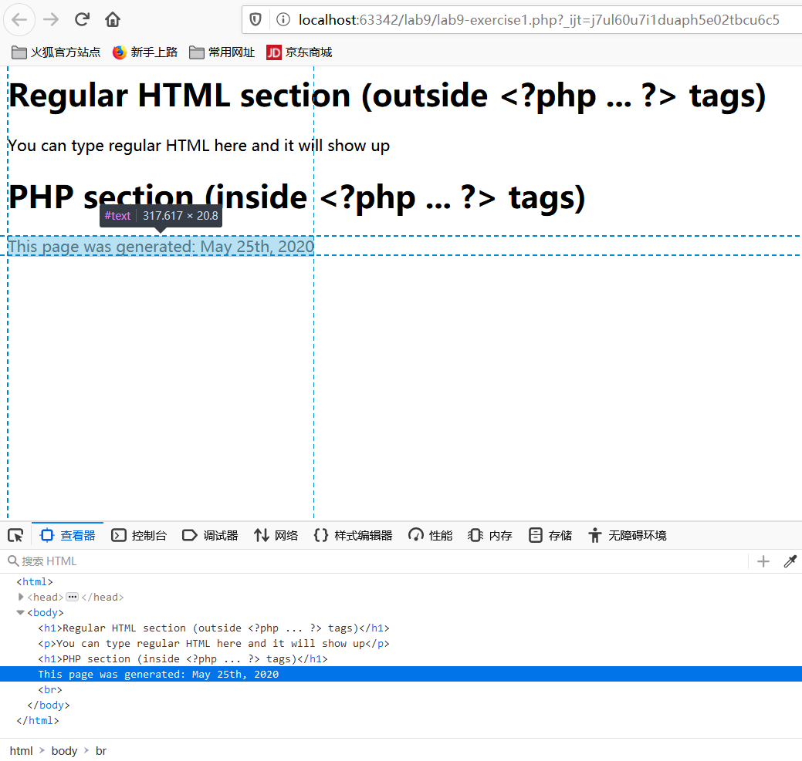

###### 代码部分

```
<?php
echo "This page was generated: " . date("M dS, Y");
echo "<br>"; //notice we must echo tags in php.
?>
```


#### Exercise 1-4

###### 网页截图

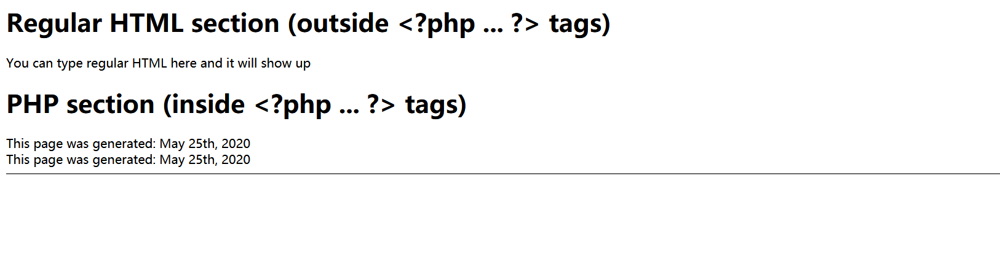

###### 代码部分

```php
<?php
//this is a php comment IN tags (will not appear)
echo "This page was generated: " . date("M dS, Y");
echo "<br>"; //notice we must echo tags in php.
echo "This page was generated: " . date("M dS, Y") . "<hr/>";
?>
```


#### Exercise 1-5

###### 网页截图

由于文字之间删去一个连接的点，生成一个错误。默认设置下，错误报告应该能在浏览器中看到，会显示语法错误的消息以及指示错误的行号。

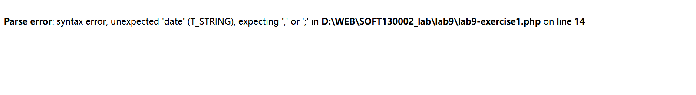

###### 代码部分

```
<?php
//this is a php comment IN tags (will not appear)
echo "This page was generated: " . date("M dS, Y");
echo "<br>"; //notice we must echo tags in php.
echo "This page was generated: " . date("M dS, Y") . "<hr/>";	//此处删去了一个点
?>
```


#### Exercise 1-6

###### 网页截图

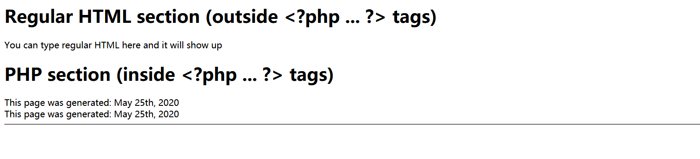

###### 代码部分

同Exercise 1-4


#### Exercise 1-7

###### 网页截图

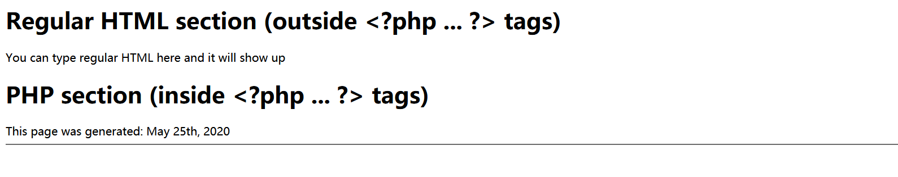

###### 代码部分

```
<?php
$d = date("M dS, Y");
echo "This page was generated: " . $d . "<hr/>";
?>
```


#### Exercise 1-8

###### **网页截图**

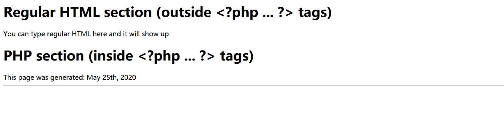

###### 代码部分

```
<?php
$date = date("M dS, Y");
echo "This page was generated: " . $date . "<hr/>";
?>
```


#### Exercise 1-9

###### 网页截图

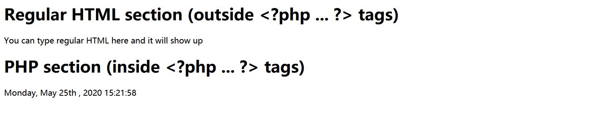

###### 代码部分

```PHP
<?php
echo date("l, M dS , Y H:i:s"); //类似Wednesday, February 26th , 2014 15:43:22形式的输出
?>
```


#### Exercise 1-10

###### 网页截图

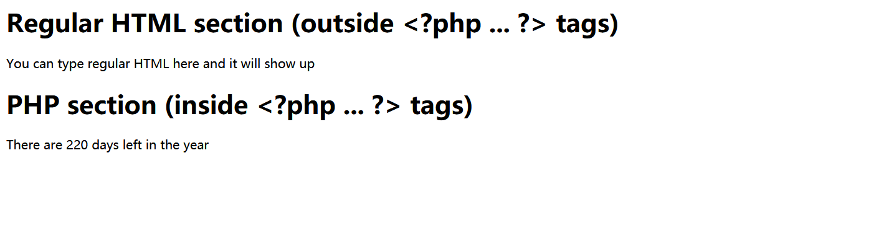

###### 代码部分

```php
<?php
$remaining = 365 - date("z");
echo "There are ". $remaining . " days left in the year";
?>
```


#### Exercise 1-11

使用date('L')，如果今年是leep year返回值1，如果不是则返回值0

###### 网页截图

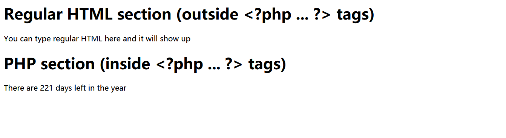

###### 代码部分

```php
<?php
$remaining = 365 + date('L') - date("z");
echo "There are ". $remaining . " days left in the year";
?>
```